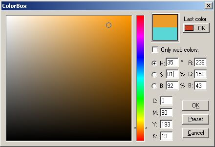



## ColorBox Version 2\.1

### Description

The AWARD WINNING colorpicker,

Colorbox hits again with more good features.

such as cmyk color indication, web only color

selection last color memory,Photoshop colorpicker like design and more..
 
### More Info
 

             |
---                |---
**Submitted On**   |2002-07-12 16:27:50
**By**             |[Saifudheen A A](https://github.com/Planet-Source-Code/PSCIndex/blob/master/ByAuthor/saifudheen-a-a.md)
**Level**          |Intermediate
**User Rating**    |5.0 (50 globes from 10 users)
**Compatibility**  |VB 4\.0 \(32\-bit\), VB 5\.0, VB 6\.0, VB Script
**Category**       |[OLE/ COM/ DCOM/ Active\-X](https://github.com/Planet-Source-Code/PSCIndex/blob/master/ByCategory/ole-com-dcom-active-x__1-29.md)
**World**          |[Visual Basic](https://github.com/Planet-Source-Code/PSCIndex/blob/master/ByWorld/visual-basic.md)
**Archive File**   |[ColorBox\_V1302839122002\.zip](https://github.com/Planet-Source-Code/saifudheen-a-a-colorbox-version-2-1__1-38924/archive/master.zip)

